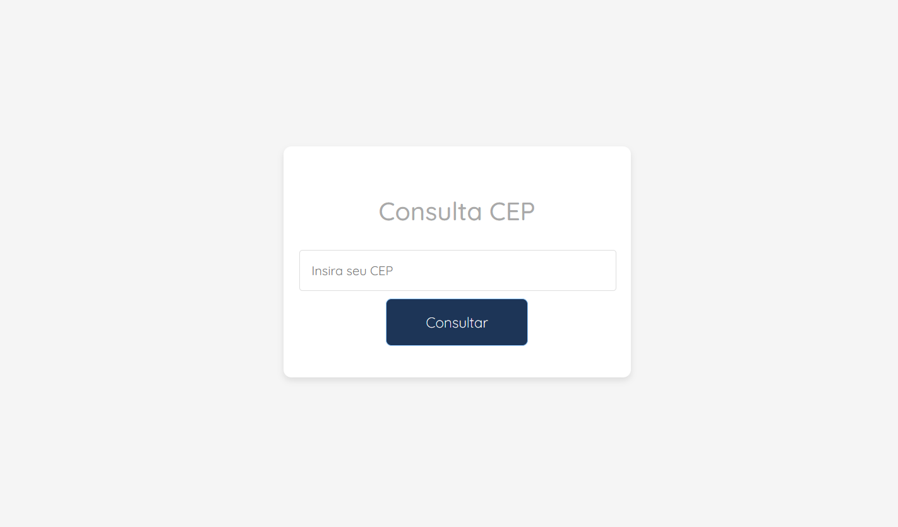
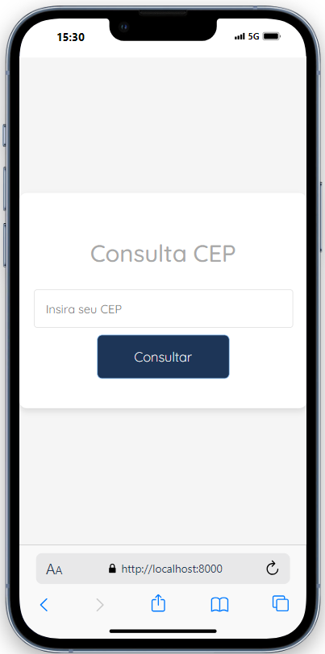

# Consulta CEP

## Descrição

Este projeto fornece uma aplicação web para consulta de informações de CEPs usando Laravel para o backend e uma interface HTML/CSS/JavaScript para o frontend. A API faz requisições ao serviço ViaCEP e exibe os respectivos.

## Tecnologias Utilizadas

- **Backend:** Laravel (PHP)
- **Frontend:** HTML, CSS, JavaScript
- **API de Consulta:** ViaCEP

## Requisitos

- PHP 8.0 ou superior
- Composer
- Laravel 9.x
- Node.js e npm (opcional, para gerenciar pacotes frontend)

## Configuração do Projeto

### Clonando o Repositório

Clone este repositório para o seu ambiente local:

```bash
git clone https://github.com/usuario/repositorio.git
cd repositorio
```

### Instalando Dependências

Para instalar as dependências do Laravel, execute:

`composer install`

### Executando o Projeto

1. **Iniciar o Servidor Laravel**

   Execute o servidor de desenvolvimento do Laravel:

   `php artisan serve`
2. **Acessar a Aplicação**

   Abra seu navegador e acesse `http://localhost:8000/front.php` para utilizar a interface de consulta de CEPs.

**O layout do projeto está assim :**

**Desktop:**


**Mobile:**




Licença

Este projeto está licenciado sob a MIT License
